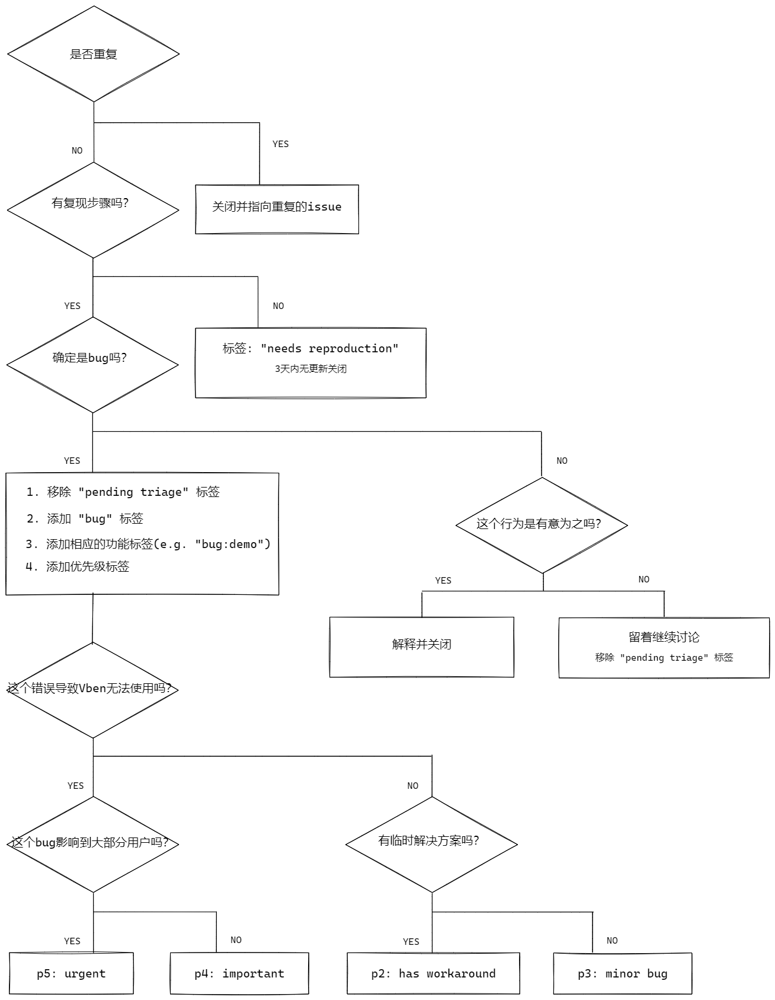
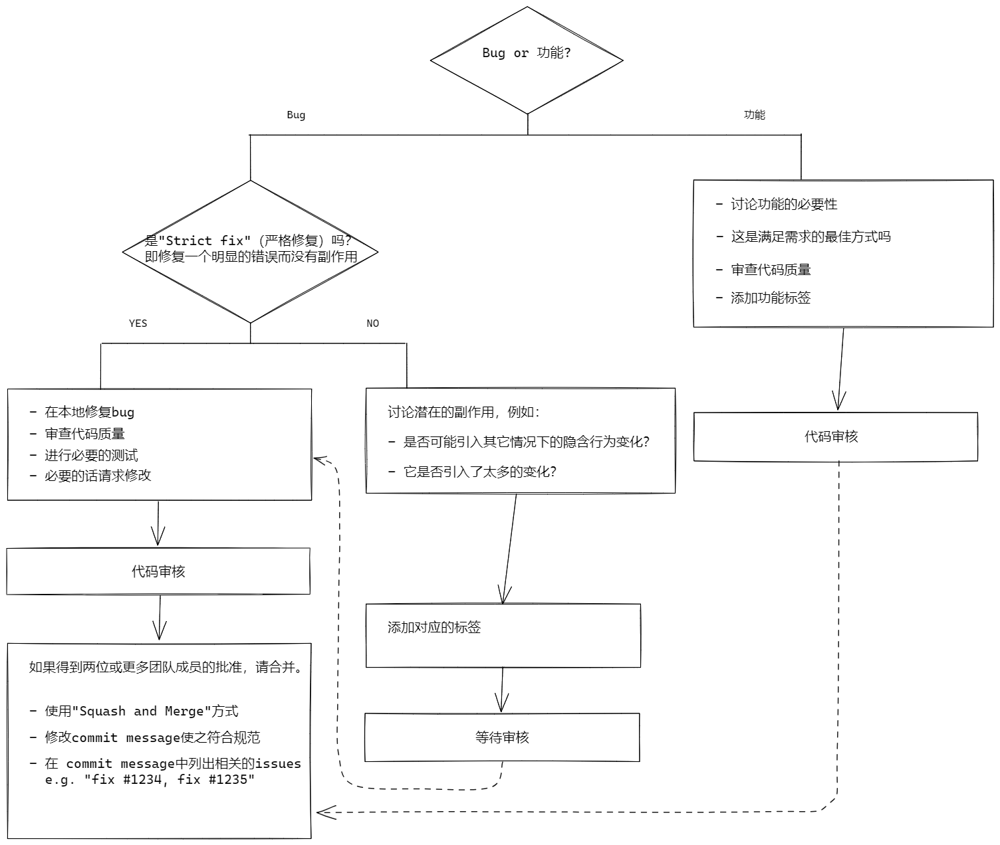

# Vben 贡献指南
你好！我们非常高兴您对为 Vben 做贡献感兴趣！在提交您的贡献之前，请仔细阅读以下指南。

## 项目结构
+ apps `演示项目`
+ packages `本地依赖库`
  + constants `静态参数，枚举等`
  + demo `演示代码[可删除]`
  + directives `指令集`
  + hooks `hooks`
  + layouts `框架布局`
  + locale `多语言`
  + request `请求依赖，默认axios`
  + styles `样式`
  + types `类型定义`
  + use `常用函数复用集合，vueuse+其他`
  + utils `工具函数集`
  + vbenComponents `通用组件封装[不限定组件库]，选用`
+ scripts `项目脚本相关`
+ configs `项目配置相关`
+ pnpm-workspace.yaml `本地依赖库配置`

## PR 指南
- 从一个分支（例如 main）创建一个主题分支，并从该分支进行合并。

- 如果是在添加新功能：

  - 添加相应的测试用例。
  - 建议先开issue进行讨论，等到批准后再开始您的工作。

- 如果是在修复错误：

  - 如果您正在解决一个特定的Bug，在您的PR标题中添加 (fix #xxxx[,#xxxx])（#xxxx 是问题编号）。例如 fix: update entities encoding/decoding (fix #3899)）
  - 在PR中提供关于错误的详细描述。最好提供一个在线演示。
  - 如果可以，添加适当的测试覆盖。
  
- PR标题必须遵循[Git提交规范](./.github/commit-convention.md)。

## 维护指南
### Issue 处理流程
<picture>
  
</picture>

### PR Review 流程
<picture>
  
</picture>

